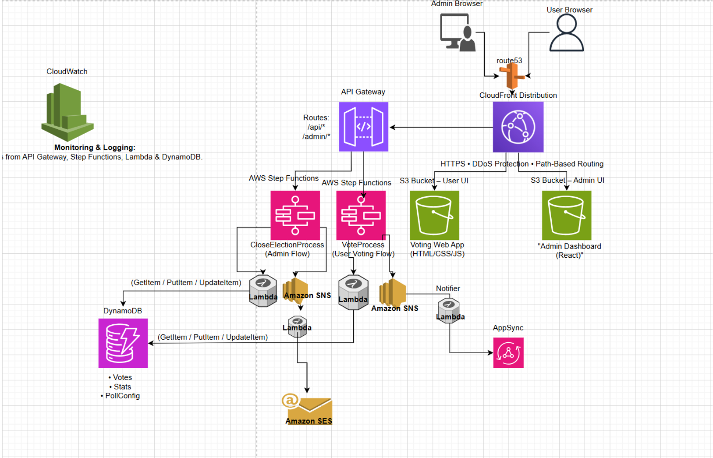
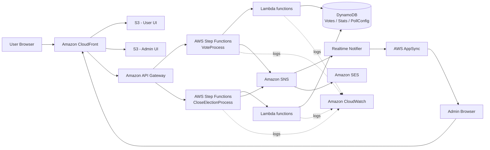

# LifeExtended

**Full-stack AWS serverless platform with separate user and admin applications, real-time updates, event-driven workflows, privacy-focused voting, and wellness/research features.**

[Live User App](https://d1133uoqbajo0.cloudfront.net) · [Live Admin App](https://d3u3dcclp55ly7.cloudfront.net)

> LifeExtended combines a React user experience, a dedicated administration dashboard, an AWS serverless backend, and a small research service. The deployed AWS architecture is configured in AWS and is documented in this repository; not every cloud resource is currently represented as Infrastructure as Code.

## Why this project stands out

- **Serverless, event-driven AWS architecture** built around API Gateway, Step Functions, Lambda, DynamoDB, SNS, AppSync, Cognito, SES, S3, CloudFront and CloudWatch.
- **Separated User and Admin flows** with independent interfaces, API paths and orchestration workflows.
- **Functionless service integrations** where API Gateway starts Step Functions directly and workflows integrate with AWS services without unnecessary glue Lambdas.
- **Real-time admin updates** through AWS AppSync GraphQL subscriptions instead of polling.
- **Database-level duplicate-vote protection** using DynamoDB conditional writes.
- **Privacy by Design**: emails are normalized and converted to SHA-256 identifiers with a secret pepper; raw email addresses are not stored as vote identifiers.
- **Observable workflows** with Step Functions execution history and CloudWatch logging across the serverless flow.
- **Live deployments** for both the user application and admin dashboard through CloudFront.

## Live applications

| Application | Purpose | Deployment |
| --- | --- | --- |
| User App | Authentication, profile, wellness metrics, research content and poll participation | [Open User App](https://d1133uoqbajo0.cloudfront.net) |
| Admin App | Authentication, poll management, dashboard and real-time results | [Open Admin App](https://d3u3dcclp55ly7.cloudfront.net) |

## System architecture

### Visual architecture overview



This visual overview highlights the deployed cloud topology across the user and admin experiences: Route 53 and CloudFront at the edge, separate S3-hosted frontends, API Gateway entry points, Step Functions orchestration, Lambda-based processing, DynamoDB persistence, SNS fan-out, AppSync real-time updates, SES notifications, and CloudWatch observability.

### Simplified interaction view



The architecture separates the two main business paths:

### User voting flow

1. The user loads the React application through **CloudFront + S3**.
2. Vote requests are routed through **API Gateway**.
3. API Gateway starts the **`VoteProcess` Step Functions state machine**.
4. Lambda functions validate and normalize the request, hash the user email and execute vote-related logic.
5. **DynamoDB conditional writes** reject duplicate votes atomically at the data layer.
6. Successful events are distributed through **SNS**.
7. **AppSync GraphQL subscriptions** push updated information to connected admin clients.

### Admin flow

1. Administrators use a dedicated React application and authenticate with **Amazon Cognito**.
2. Admin operations use separate `/admin/*` paths from the public voting flow.
3. Poll management and closure use a separate orchestration path, including **`CloseElectionProcess`**.
4. Final results can be formatted by the workflow and distributed through **SNS / SES**.
5. The dashboard receives live updates through **AppSync**.

For the deeper architecture walkthrough, see [Architecture](docs/ARCHITECTURE.md) and [AWS Workflows](docs/AWS_WORKFLOWS.md).

## Security and privacy

The project was designed using **Defense in Depth**, **Least Privilege**, **Zero Trust toward the client**, and **Privacy by Design** principles.

Key controls include:

- HTTPS delivery through CloudFront.
- Separate user/admin interfaces and API routes.
- Cognito authentication for administrative access.
- Server-side input validation using an allow-list approach.
- SHA-256 hashing with a secret pepper for vote identity.
- DynamoDB `ConditionExpression` enforcement for one-vote semantics.
- Atomic DynamoDB updates for shared counters/statistics in the deployed workflow.
- Dedicated IAM roles with scoped permissions.
- No direct browser access to Lambda or DynamoDB.
- CloudWatch / Step Functions logs for auditing and troubleshooting.

More detail: [Security Architecture](docs/SECURITY.md).

## Real-time architecture

The admin application uses **AWS AppSync GraphQL subscriptions** for push-based updates. The deployed design uses a lightweight AppSync resolver path to broadcast events to connected clients, avoiding repeated polling and redundant database reads.

This keeps the dashboard responsive while preserving loose coupling between vote processing and presentation.

## AWS workflow snapshots

- [VoteProcess state-machine walkthrough](docs/AWS_WORKFLOWS.md#voteprocess)
- [CloseElectionProcess state-machine walkthrough](docs/AWS_WORKFLOWS.md#closeelectionprocess)

## Application features

### User application

- Cognito sign-in, registration and confirmation flows.
- Protected application routes.
- User profile management.
- Client-side wellness metrics such as load, fatigue, crash risk and stability.
- Poll/survey participation.
- Research content integration using Europe PMC.

### Admin application

- Cognito-based admin authentication.
- Protected admin routes.
- Poll creation, update and deletion flows.
- Active-poll dashboard.
- Live results UI.
- AppSync subscription integration.

### Serverless backend

The repository contains Lambda handlers for responsibilities such as:

- Input validation.
- Email hashing.
- Vote writing and duplicate prevention.
- Poll creation, update, deletion and retrieval.
- Election result calculation.
- Real-time AppSync notification.
- Administrative/reset utilities.

### Research service

A small Express service exposes a research endpoint backed by Semantic Scholar, while the user frontend also includes a Europe PMC research feed.

## Technology stack

**Frontend**

- React 19
- Vite
- TypeScript / JavaScript
- Redux Toolkit
- React Router
- AWS Amplify

**AWS / Backend**

- Amazon CloudFront
- Amazon S3
- Amazon API Gateway
- AWS Step Functions
- AWS Lambda
- Amazon DynamoDB
- Amazon SNS
- AWS AppSync
- Amazon Cognito
- Amazon SES
- Amazon CloudWatch
- IAM

**Research service**

- Node.js
- Express
- Semantic Scholar API
- Europe PMC API

## Repository structure

```text
LifeExtended-Platform/
├── apps/
│   ├── client/              # User React application
│   └── admin/               # Admin React application
├── backend/
│   └── functions/           # AWS Lambda handlers
├── server/                  # Research API service
├── infrastructure/          # Notes about deployed AWS infrastructure
├── docs/
│   ├── ARCHITECTURE.md
│   ├── AWS_WORKFLOWS.md
│   ├── SECURITY.md
│   └── OBSERVABILITY.md
└── README.md
```

## Running locally

### User application

```bash
cd apps/client
npm ci
npm run dev
```

### Admin application

```bash
cd apps/admin
npm ci
npm run dev
```

The admin application requires the runtime values documented in `apps/admin/.env.example`.

### Research server

```bash
cd server
npm ci
node index.js
```

## Current repository status

This repository is the **canonical unified repository** for LifeExtended. It consolidates the user application, admin application, Lambda backend and research server that were previously maintained separately.

The AWS environment is already deployed, while the repository is being progressively improved with cleaner application architecture, stronger documentation and safer configuration management.

A stable pre-refactor snapshot is tagged as:

```text
baseline-pre-refactor
```

## Documentation

- [AWS / Application Architecture](docs/ARCHITECTURE.md)
- [AWS Workflow Walkthroughs](docs/AWS_WORKFLOWS.md)
- [Security Architecture](docs/SECURITY.md)
- [Logging & Observability](docs/OBSERVABILITY.md)
- [Infrastructure Notes](infrastructure/README.md)

## Legacy repositories

The project was originally split across multiple repositories. They are kept for history, while this repository is the canonical version going forward.

- [Original User Repository](https://github.com/edelagziel/LifeExtended)
- [Original Admin Repository](https://github.com/edelagziel/LifeExtended_Admin)
- [Original Lambda Backend Repository](https://github.com/edelagziel/LifeExtendedBackendLambada)

## Project direction

The next stages focus on incremental React/backend refactoring, stronger regression coverage, additional architecture documentation, and a separate experimental intelligence subsystem that will only be integrated after its runtime and ML pipeline are stabilized.
