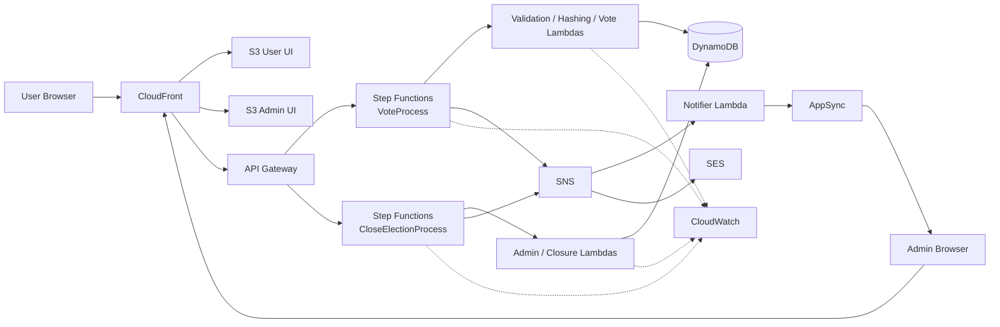

# LifeExtended Architecture

## Overview

LifeExtended uses a **serverless, event-driven AWS architecture** with two intentionally separated business flows:

- **User Flow** — vote submission and user-facing application behavior.
- **Admin Flow** — poll management, closure, monitoring and results handling.

The two flows use separate user interfaces, API paths and Step Functions workflows while sharing managed AWS services such as API Gateway, Lambda, DynamoDB, SNS, AppSync and CloudWatch.

> Important: much of the deployed AWS infrastructure was configured directly in AWS rather than committed as Infrastructure as Code. This document describes the deployed architecture together with the source code stored in this repository.

## Deployed frontends

- User application: https://d1133uoqbajo0.cloudfront.net
- Admin application: https://d3u3dcclp55ly7.cloudfront.net

The React applications are hosted as static assets in Amazon S3 and distributed through Amazon CloudFront.

## High-level architecture

## User flow — vote submission

### 1. Entry and routing

The user opens the React application through CloudFront. Static requests are served from S3, while logical/API requests are routed toward API Gateway.

### 2. API Gateway service integration

The deployed design uses a direct service integration pattern in which API Gateway starts an AWS Step Functions execution instead of introducing a Lambda solely as glue between the API and workflow.

This reduces custom orchestration code and keeps the business flow visible in the state machine.

### 3. VoteProcess orchestration

`VoteProcess` coordinates the main voting workflow. Responsibilities include:

- input validation and sanitization,
- email normalization,
- privacy-preserving identity generation,
- duplicate-vote enforcement,
- statistics updates,
- logical branching and failure paths,
- event publication after successful processing.

The repository contains Lambda handlers for the application-level portions of this flow, including `ValidateInput`, `HashEmail` and `WriteVote`.

### 4. Privacy-preserving identity

The user's email is normalized and converted to a deterministic SHA-256 identifier using a secret pepper. The deployed implementation uses runtime configuration for the pepper rather than storing it in source code.

The raw email is not used as the DynamoDB vote identifier.

### 5. Duplicate-vote prevention

The `Votes` table uses DynamoDB conditional writes to enforce one-vote semantics atomically at the data layer.

This is important under concurrency: two simultaneous requests for the same logical voter cannot both succeed merely because they passed an earlier application-level check.

### 6. Statistics

The deployed workflow updates shared statistics using DynamoDB atomic update semantics. The repository also contains source for reading/resetting the `Stats` table.

### 7. Event-driven post-processing

After a successful vote, the workflow publishes an event through Amazon SNS. Consumers are decoupled from the main voting transaction.

This allows downstream responsibilities such as real-time notification and administrative reporting to evolve independently.

## Real-time admin updates

LifeExtended uses AWS AppSync GraphQL subscriptions for push-based updates in the Admin application.

The current source contains:

- AppSync client configuration,
- GraphQL subscription definitions,
- the `LiveResults` UI,
- a notification Lambda that publishes updated values to AppSync.

The deployed AppSync path uses a lightweight resolver approach intended to broadcast events rather than repeatedly query the database from every connected client.

## Admin flow

The Admin application is a separate React application protected with Amazon Cognito authentication.

Admin responsibilities include:

- creating polls,
- updating poll metadata,
- deleting polls,
- viewing the current poll,
- monitoring live results,
- initiating the poll-closure flow.

The deployed architecture uses a separate Step Functions workflow, `CloseElectionProcess`, for the administrative closure path.

The closure flow retrieves final statistics, computes final results and formats summary output. SNS is used for fan-out to administrative consumers and notification paths.

## DynamoDB data model

The system uses three principal tables:

- **Votes** — vote records keyed by a privacy-preserving user hash.
- **Stats** — aggregated voting statistics.
- **PollConfig** — active poll configuration and metadata.

This separation keeps responsibilities clear and allows different access patterns for transactional vote enforcement, fast results reads and configuration management.

## Cognito authentication

Both frontend applications include Cognito authentication flows. The Admin application uses protected routes so privileged screens are not accessible as ordinary public application pages.

Authentication configuration is application runtime configuration; privileged authorization should remain enforced by backend/AWS policies rather than client-side route checks alone.

## Research functionality

LifeExtended also includes research-oriented functionality separate from the voting backend:

- Europe PMC content in the User application.
- A small Express service with a Semantic Scholar endpoint.

These components are intentionally documented separately from the core AWS voting flow.

## Architecture principles

The AWS design emphasizes:

- **Serverless first** — no persistent application servers for the core voting platform.
- **Event-driven integration** — SNS for loose coupling and fan-out.
- **Orchestration over glue code** — Step Functions for workflow control.
- **Data-layer correctness** — DynamoDB conditional and atomic operations.
- **Separated trust boundaries** — distinct User and Admin interfaces and paths.
- **Privacy by Design** — raw vote identity is not stored directly.
- **Observable workflows** — Lambda and Step Functions execution logging.

## Source vs deployed infrastructure

This repository contains the application source and Lambda handlers, but currently does **not** contain a complete IaC representation of every AWS resource.

For example, CloudFront distributions, S3 buckets, API Gateway service integrations, Step Functions definitions, SNS configuration, AppSync resolver configuration, IAM policies and CloudWatch settings may exist in AWS without an equivalent Terraform/CloudFormation/CDK file in this repository.

That distinction is intentional in the documentation: the repository documents both the committed source and the deployed AWS architecture without pretending that all infrastructure is currently codified.
