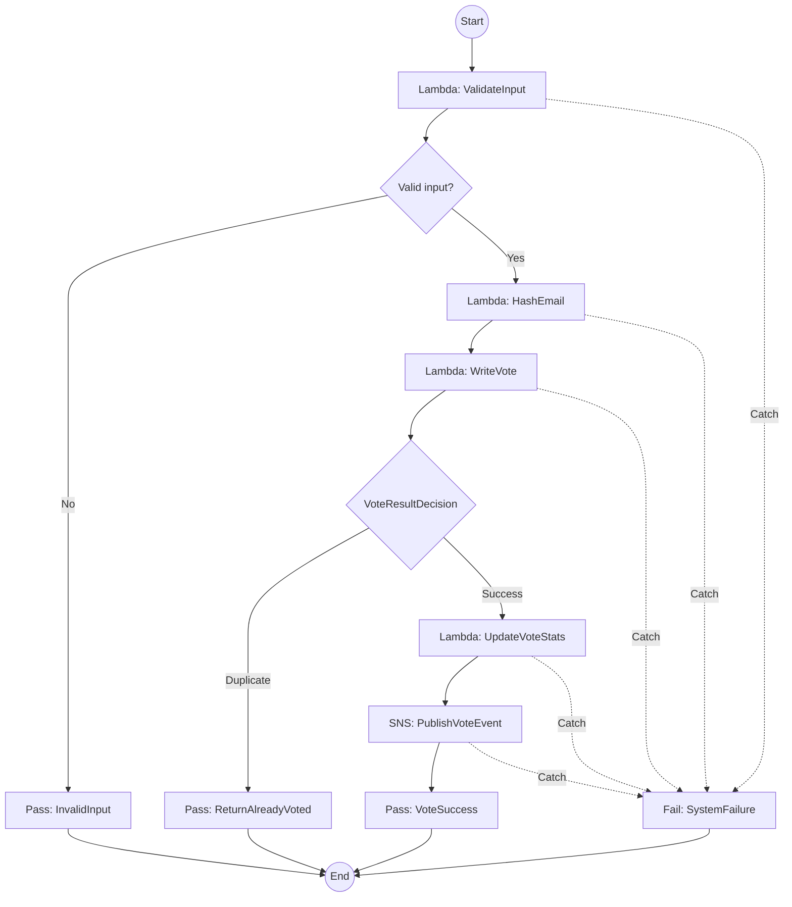
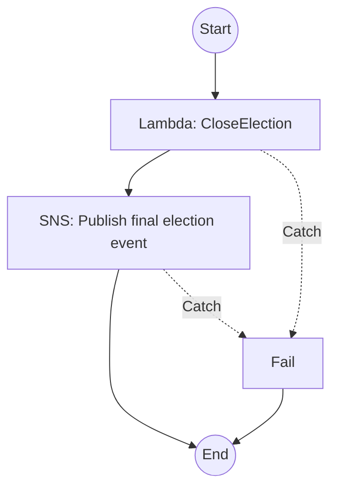

# AWS Workflow Visuals

This document captures the two core Step Functions workflows used by the deployed LifeExtended voting platform.

## VoteProcess — User Voting Workflow

### What this workflow demonstrates

- Input validation before any write operation.
- Privacy-oriented email hashing before persistence.
- Duplicate-vote handling at the data layer.
- Separate success and failure paths.
- Event publication only after a successful vote.
- Centralized orchestration and error handling in Step Functions.

## CloseElectionProcess — Admin Closure Workflow

### What this workflow demonstrates

- A dedicated administrative workflow separated from the public voting path.
- Election-close logic encapsulated behind a specific Lambda responsibility.
- SNS fan-out after successful completion.
- Explicit failure handling for both compute and messaging stages.

## Relationship to the full architecture

These state machines sit behind API Gateway and connect the frontend applications to Lambda, DynamoDB, SNS, AppSync, SES and CloudWatch. See [`ARCHITECTURE.md`](ARCHITECTURE.md) for the complete system view.
